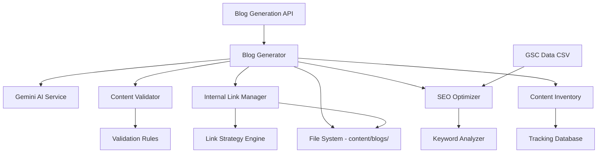

# Design Document: SEO Blog Expansion

## Overview

The SEO Blog Expansion feature extends the existing Habet blog system to generate 5-10 new SEO-optimized blog posts targeting "habet" and related keywords from Google Search Console data. The system will create EEAT-compliant content with strategic internal linking, validate content quality, and update existing posts with bidirectional links.

### Goals

- Generate 5-10 new blog posts (2500-4000 words each) targeting high-impression, zero-click GSC keywords
- Implement strategic internal linking with 20-25 links per post
- Ensure EEAT compliance with data-backed claims, expert authorship, and actionable advice
- Update 3 existing blog posts with links to new content
- Validate all content meets SEO and quality standards before publication
- Track content performance and keyword targeting to avoid cannibalization

### Non-Goals

- Automated content publishing without validation
- Real-time GSC API integration (manual CSV analysis is sufficient)
- Multi-language content generation beyond English with Hindi phrases
- Image generation or optimization
- Automated A/B testing of content variations

### Success Metrics

- 5-10 new blog posts published with 2500+ words each
- 20-25 internal links per new post
- 8-12 new internal links added to each existing post
- 100% of posts pass content validation (word count, keyword density, link validation)
- Zero keyword cannibalization (unique primary keyword per post)
- All posts include EEAT elements (data points, expert attribution, disclaimers)

## Architecture

The system extends the existing blog infrastructure with four new components:



### Component Responsibilities

**Blog Generator** (`lib/blog-generator.ts`)
- Orchestrates the blog creation workflow
- Calls Gemini AI to generate content
- Constructs frontmatter with metadata
- Validates generated content before saving
- Manages file creation in content/blogs/

**Content Validator** (`lib/content-validator.ts`)
- Validates word count (2500-4000 words)
- Checks keyword density (0.8-1.2% for primary keyword)
- Validates internal link count and targets
- Verifies frontmatter completeness and format
- Checks for duplicate titles and slugs
- Validates heading structure (H1, H2, H3 counts)

**Internal Link Manager** (`lib/internal-link-manager.ts`)
- Analyzes content for link insertion opportunities
- Inserts 20-25 contextually relevant internal links
- Distributes links throughout content (intro, body, conclusion)
- Updates existing posts with links to new content
- Validates all link targets exist
- Ensures no more than 3 links per paragraph

**SEO Optimizer** (`lib/seo-optimizer.ts`)
- Analyzes GSC data to identify target keywords
- Prioritizes high-impression, zero-click keywords
- Classifies search intent (informational, navigational, transactional)
- Generates blog topics aligned with user intent
- Validates keyword targeting to prevent cannibalization
- Creates keyword mapping document

**Content Inventory Tracker** (`lib/content-inventory.ts`)
- Logs metadata for each generated post
- Tracks keyword assignments per post
- Generates summary reports
- Maintains schema markup recommendations
- Provides data structure for future GSC performance tracking

### Data Flow

1. **Topic Selection**: SEO Optimizer analyzes GSC CSV data and selects 5-10 topics targeting high-value keywords
2. **Content Generation**: Blog Generator calls Gemini AI with topic and keywords, receives markdown content
3. **Frontmatter Construction**: Blog Generator extracts title, generates slug, creates excerpt, calculates reading time
4. **Internal Linking**: Internal Link Manager inserts 20-25 links into new content and identifies insertion points in existing posts
5. **Validation**: Content Validator checks all quality criteria before file creation
6. **File Creation**: Blog Generator writes markdown file to content/blogs/
7. **Inventory Update**: Content Inventory Tracker logs post metadata
8. **Existing Post Update**: Internal Link Manager updates 3 existing posts with new links

## Components and Interfaces

### Blog Generator

```typescript
interface BlogGeneratorConfig {
  minWordCount: number; // 2500
  maxWordCount: number; // 4000
  targetKeywordDensity: { min: number; max: number }; // 0.008, 0.012
  author: string; // "HABET Sports Team"
  outputDir: string; // "content/blogs"
}

interface BlogGenerationRequest {
  topic: string;
  primaryKeyword: string;
  secondaryKeywords: string[];
  searchIntent: "informational" | "navigational" | "transactional";
}

interface BlogGenerationResult {
  success: boolean;
  slug: string;
  title: string;
  wordCount: number;
  internalLinkCount: number;
  validationErrors: string[];
}

class BlogGenerator {
  constructor(config: BlogGeneratorConfig);
  
  async generateBlogPost(request: BlogGenerationRequest): Promise<BlogGenerationResult>;
  async generateMultiplePosts(requests: BlogGenerationRequest[]): Promise<BlogGenerationResult[]>;
}
```

### Content Validator

```typescript
interface ValidationRule {
  name: string;
  validate: (post: BlogPost) => ValidationResult;
}

interface ValidationResult {
  passed: boolean;
  errors: string[];
  warnings: string[];
}

interface BlogPost {
  frontmatter: BlogFrontmatter;
  content: string;
}

class ContentValidator {
  private rules: ValidationRule[];
  
  validateWordCount(post: BlogPost): ValidationResult;
  validateKeywordDensity(post: BlogPost, primaryKeyword: string): ValidationResult;
  validateInternalLinks(post: BlogPost): ValidationResult;
  validateFrontmatter(post: BlogPost): ValidationResult;
  validateHeadingStructure(post: BlogPost): ValidationResult;
  validateUniqueness(post: BlogPost, existingPosts: BlogPost[]): ValidationResult;
  
  validateAll(post: BlogPost, existingPosts: BlogPost[]): ValidationResult;
}
```

### Internal Link Manager

```typescript
interface LinkInsertionPoint {
  paragraphIndex: number;
  sentenceIndex: number;
  anchorText: string;
  targetUrl: string;
  relevanceScore: number;
}

interface LinkDistributionStrategy {
  introLinks: number; // 2
  bodyLinks: number; // 15-18
  conclusionLinks: number; // 3-5
  maxLinksPerParagraph: number; // 3
}

interface InternalLinkConfig {
  targetLinkCount: { min: number; max: number }; // 20, 25
  distribution: LinkDistributionStrategy;
  linkTargets: LinkTarget[];
}

interface LinkTarget {
  url: string;
  title: string;
  keywords: string[];
  type: "blog" | "page";
}

class InternalLinkManager {
  constructor(config: InternalLinkConfig);
  
  async insertLinks(content: string, linkTargets: LinkTarget[]): Promise<string>;
  async updateExistingPost(slug: string, newLinkTargets: LinkTarget[]): Promise<void>;
  findInsertionPoints(content: string, linkTargets: LinkTarget[]): LinkInsertionPoint[];
  validateLinkTargets(links: string[]): Promise<boolean>;
}
```

### SEO Optimizer

```typescript
interface GSCKeywordData {
  query: string;
  clicks: number;
  impressions: number;
  ctr: number;
  position: number;
}

interface KeywordAnalysis {
  keyword: string;
  searchVolume: number; // from impressions
  competition: number; // derived from position
  intent: "informational" | "navigational" | "transactional";
  priority: number; // calculated score
}

interface TopicRecommendation {
  topic: string;
  primaryKeyword: string;
  secondaryKeywords: string[];
  searchIntent: "informational" | "navigational" | "transactional";
  targetAudience: string;
  contentAngle: string;
}

class SEOOptimizer {
  async analyzeGSCData(csvPath: string): Promise<KeywordAnalysis[]>;
  prioritizeKeywords(keywords: KeywordAnalysis[]): KeywordAnalysis[];
  classifySearchIntent(keyword: string): "informational" | "navigational" | "transactional";
  generateTopicRecommendations(keywords: KeywordAnalysis[], count: number): TopicRecommendation[];
  validateKeywordCannibalization(newKeyword: string, existingPosts: BlogPost[]): boolean;
}
```

### Content Inventory Tracker

```typescript
interface ContentInventoryEntry {
  id: string; // UUID
  slug: string;
  title: string;
  primaryKeyword: string;
  secondaryKeywords: string[];
  wordCount: number;
  internalLinkCount: number;
  createdAt: string; // ISO 8601
  lastUpdated?: string; // ISO 8601
  schemaType: "Article" | "HowTo" | "FAQPage";
  gscMetrics?: {
    clicks: number;
    impressions: number;
    ctr: number;
    position: number;
  };
}

interface ContentInventorySummary {
  totalPosts: number;
  totalWordCount: number;
  totalInternalLinks: number;
  keywordCoverage: Map<string, string>; // keyword -> slug
  averageWordCount: number;
  averageLinksPerPost: number;
}

class ContentInventoryTracker {
  async logPost(entry: ContentInventoryEntry): Promise<void>;
  async updatePost(slug: string, updates: Partial<ContentInventoryEntry>): Promise<void>;
  async generateSummary(): Promise<ContentInventorySummary>;
  async exportKeywordMapping(): Promise<Map<string, string>>;
  async checkKeywordConflict(keyword: string): Promise<string | null>; // returns conflicting slug or null
}
```

## Data Models

### Blog Frontmatter (Extended)

```typescript
interface BlogFrontmatter {
  title: string; // Unique, includes target keyword
  slug: string; // Unique, kebab-case
  date: string; // ISO 8601 format
  excerpt: string; // 150-160 characters, includes primary keyword
  keywords: string[]; // 8-12 keywords
  author: string; // "HABET Sports Team"
  readingTime: string; // e.g., "7 min read"
  lastUpdated?: string; // ISO 8601, added when existing posts are updated
  id?: string; // UUID for tracking (optional, added by inventory tracker)
}
```

### Content Validation Schema

```typescript
interface ContentValidationSchema {
  wordCount: {
    min: 2500;
    max: 4000;
  };
  keywordDensity: {
    min: 0.008; // 0.8%
    max: 0.012; // 1.2%
  };
  internalLinks: {
    min: 20;
    max: 25;
    maxPerParagraph: 3;
    distribution: {
      intro: 2;
      body: { min: 15; max: 18 };
      conclusion: { min: 3; max: 5 };
    };
  };
  headingStructure: {
    h1: { min: 1; max: 1 };
    h2: { min: 5; max: 8 };
    h3: { min: 10; max: 15 };
  };
  requiredSections: ["FAQ", "Conclusion"];
  excerptLength: {
    min: 150;
    max: 160;
  };
  keywordsCount: {
    min: 8;
    max: 12;
  };
}
```

### Link Target Registry

```typescript
interface LinkTargetRegistry {
  blogs: Array<{
    slug: string;
    title: string;
    keywords: string[];
    url: string; // e.g., "/blog/habet-app-download-guide"
  }>;
  pages: Array<{
    path: string;
    title: string;
    keywords: string[];
    url: string; // e.g., "/", "/about", "/disclaimer"
  }>;
}
```

### GSC Data Model

```typescript
interface GSCQueryData {
  query: string;
  clicks: number;
  impressions: number;
  ctr: number;
  position: number;
}

interface GSCPageData {
  page: string;
  clicks: number;
  impressions: number;
  ctr: number;
  position: number;
}
```

### Content Inventory Database Schema

```typescript
interface ContentInventoryDatabase {
  posts: ContentInventoryEntry[];
  keywordMap: Map<string, string>; // primaryKeyword -> slug
  metadata: {
    lastGenerated: string; // ISO 8601
    totalPosts: number;
    version: string; // e.g., "1.0.0"
  };
}
```


## Correctness Properties

*A property is a characteristic or behavior that should hold true across all valid executions of a system—essentially, a formal statement about what the system should do. Properties serve as the bridge between human-readable specifications and machine-verifiable correctness guarantees.*

### Property 1: Keyword Density Validation

*For any* blog post content and primary keyword, when calculating keyword density, the validator SHALL correctly identify whether the density falls within the acceptable range (0.8-1.2%) based on the actual occurrence count and total word count.

**Validates: Requirements 1.2, 7.3**

### Property 2: Slug Generation and Uniqueness

*For any* blog post title and set of existing slugs, the slug generator SHALL produce a valid kebab-case slug that is unique within the existing set, and the validator SHALL correctly identify duplicate slugs.

**Validates: Requirements 1.4, 7.2**

### Property 3: Word Count Validation

*For any* markdown content, the word count validator SHALL correctly calculate the total word count and identify whether it falls within the acceptable range (2500-4000 words).

**Validates: Requirements 1.5**

### Property 4: Heading Structure Validation

*For any* markdown content, the heading structure validator SHALL correctly count H1, H2, and H3 headings and identify whether the structure meets requirements (1 H1, 5-8 H2, 10-15 H3).

**Validates: Requirements 1.6**

### Property 5: Frontmatter Completeness

*For any* blog post frontmatter object, the validator SHALL correctly identify whether all required fields (title, slug, date, excerpt, keywords, author, readingTime) are present and properly formatted, including ISO 8601 date format and UUID when required.

**Validates: Requirements 1.7, 3.3, 7.8, 9.1, 10.1**

### Property 6: Internal Link Count and Distribution

*For any* blog post content with inserted internal links, the validator SHALL correctly count total links (20-25), verify distribution across sections (2 intro, 15-18 body, 3-5 conclusion), and ensure minimum blog post links (3) and page links (5) are present.

**Validates: Requirements 2.1, 2.2, 2.6, 5.2**

### Property 7: Relative URL Format

*For any* set of internal links in blog content, all links SHALL use relative URL format (starting with /) rather than absolute URLs.

**Validates: Requirements 2.5**

### Property 8: Links Per Paragraph Limit

*For any* blog post content with inserted internal links, no single paragraph SHALL contain more than 3 internal links.

**Validates: Requirements 2.4**

### Property 9: Homepage Link Insertion

*For any* blog post content containing "HABET APK" or "HABET app" phrases, the link manager SHALL insert at least one link to the homepage (/) for every 1000 words of content.

**Validates: Requirements 2.7**

### Property 10: FAQ Section Validation

*For any* markdown content, the validator SHALL correctly identify whether a FAQ section exists with the proper heading (## FAQ) and contains 4-6 question-answer pairs.

**Validates: Requirements 3.5**

### Property 11: GSC Keyword Filtering

*For any* GSC dataset with query data (impressions, clicks), the SEO optimizer SHALL correctly filter and prioritize keywords with 10+ impressions and 0 clicks, ranking them by priority score.

**Validates: Requirements 4.1**

### Property 12: Keyword Assignment Validation

*For any* blog post, the validator SHALL verify that exactly 1 primary keyword and 5-8 secondary keywords are assigned from the GSC data.

**Validates: Requirements 4.4**

### Property 13: Search Intent Classification
  
*For any* search query string, the SEO optimizer SHALL classify it into exactly one of three categories (informational, navigational, transactional) based on keyword patterns and query structure.

**Validates: Requirements 4.5**

### Property 14: Primary Keyword Placement

*For any* blog post content and primary keyword, the validator SHALL correctly identify whether the primary keyword appears within the first 100 words of the content.

**Validates: Requirements 4.6**

### Property 15: Call-to-Action Validation

*For any* blog post targeting download-intent keywords, the validator SHALL correctly identify whether at least one CTA link to the download page is present in the content.

**Validates: Requirements 4.7**

### Property 16: Link Insertion Point Identification

*For any* existing blog post content and set of new link targets, the link manager SHALL identify 5-8 contextually relevant insertion points based on keyword matching and sentence structure.

**Validates: Requirements 5.1**

### Property 17: Content Structure Preservation

*For any* existing blog post content, when links are inserted, the heading count and paragraph count SHALL remain unchanged, preserving the original structure.

**Validates: Requirements 5.3**

### Property 18: Frontmatter Preservation on Update

*For any* existing blog post with frontmatter, when the content body is updated with new links, all original frontmatter fields (except lastUpdated) SHALL remain unchanged.

**Validates: Requirements 5.4**

### Property 19: Link Target Validation

*For any* set of internal links in blog content, the validator SHALL correctly identify whether all link targets (URLs) are valid relative paths and whether all referenced blog posts and pages exist in the system.

**Validates: Requirements 5.5, 7.6**

### Property 20: Title Uniqueness Validation

*For any* new blog post title and set of existing blog post titles, the validator SHALL correctly identify whether the new title is unique (no exact duplicates).

**Validates: Requirements 7.1**

### Property 21: Excerpt Validation

*For any* blog post excerpt and primary keyword, the validator SHALL correctly verify that the excerpt length is between 150-160 characters and that the primary keyword appears at least once in the excerpt.

**Validates: Requirements 7.4**

### Property 22: Reading Time Calculation

*For any* blog post word count, the reading time calculator SHALL produce the correct reading time string (e.g., "7 min read") based on 200 words per minute, rounded up to the nearest minute.

**Validates: Requirements 7.5**

### Property 23: Mobile Readability Validation

*For any* blog post content, the validator SHALL correctly identify violations of mobile readability rules: paragraphs exceeding 5 sentences, sections exceeding 400 words between headings, average sentence length exceeding 20 words, and insufficient lists (minimum 4).

**Validates: Requirements 8.1, 8.2, 8.3, 8.6**

### Property 24: Visual Element Validation

*For any* blog post content, the validator SHALL correctly count bold text occurrences (5-10 required), blockquotes (1 per 1000 words required), and verify TOC presence for posts exceeding 2000 words.

**Validates: Requirements 8.4, 8.5, 8.7**

### Property 25: Content Inventory Summary Calculation

*For any* set of blog posts with metadata, the inventory tracker SHALL correctly calculate summary statistics: total posts, total word count, total internal links, average word count, average links per post, and keyword coverage map.

**Validates: Requirements 9.3, 9.4**

### Property 26: Keyword Cannibalization Prevention

*For any* new blog post with a primary keyword and set of existing blog posts, the validator SHALL correctly identify whether the primary keyword conflicts with any existing post's primary keyword.

**Validates: Requirements 9.6**

### Property 27: Schema Type Assignment

*For any* blog post content, the schema type assigner SHALL correctly classify the post as "Article", "HowTo", or "FAQPage" based on content structure (presence of step-by-step instructions, FAQ sections, etc.).

**Validates: Requirements 9.7**

### Property 28: Date Consistency Validation

*For any* blog post with frontmatter date and content containing date references (e.g., "2026", "January 2026"), the validator SHALL correctly identify whether all date references are consistent with the frontmatter date field's year.

**Validates: Requirements 10.5**


## Error Handling

### Gemini AI Generation Failures

**Error Scenario**: Gemini API returns an error, rate limit exceeded, or generates malformed content

**Handling Strategy**:
- Implement exponential backoff retry logic (3 attempts with 2s, 4s, 8s delays)
- Log API errors with request context for debugging
- Validate generated markdown structure before accepting response
- If all retries fail, skip the topic and continue with remaining topics
- Return partial success response indicating which topics succeeded/failed

**Error Response**:
```typescript
{
  success: false,
  error: "Gemini API rate limit exceeded",
  partialResults: [
    { slug: "topic-1", status: "success" },
    { slug: "topic-2", status: "failed", error: "API timeout" }
  ]
}
```

### Content Validation Failures

**Error Scenario**: Generated content fails validation (word count, keyword density, link count, structure)

**Handling Strategy**:
- Collect all validation errors before rejecting content
- Provide detailed error messages indicating which rules failed
- Do not save invalid content to file system
- Log validation failures with content metadata for analysis
- Return validation errors to caller for potential retry with adjusted parameters

**Error Response**:
```typescript
{
  success: false,
  validationErrors: [
    "Word count 1847 below minimum 2500",
    "Keyword density 0.3% below minimum 0.8%",
    "Missing FAQ section"
  ]
}
```

### File System Errors

**Error Scenario**: Unable to write blog file, directory doesn't exist, permission denied

**Handling Strategy**:
- Check directory exists and create if missing before writing files
- Use atomic write operations (write to temp file, then rename)
- Catch and log file system errors with full path context
- Roll back any partial writes if batch operation fails
- Return clear error message indicating file system issue

**Error Response**:
```typescript
{
  success: false,
  error: "Failed to write file: EACCES permission denied",
  path: "content/blogs/new-post.md"
}
```

### Link Target Validation Errors

**Error Scenario**: Internal link references non-existent blog post or page

**Handling Strategy**:
- Validate all link targets exist before inserting links
- Maintain registry of valid blog slugs and page paths
- Remove or replace invalid link targets with fallback (homepage)
- Log warnings for invalid link targets
- Continue processing with valid links only

**Error Response**:
```typescript
{
  success: true,
  warnings: [
    "Link target /blog/non-existent-post not found, replaced with /",
    "Link target /invalid-page not found, removed from content"
  ]
}
```

### Duplicate Slug/Title Errors

**Error Scenario**: Generated slug or title conflicts with existing post

**Handling Strategy**:
- Check for duplicates before file creation
- Append numeric suffix to slug if conflict detected (e.g., "post-title-2")
- Regenerate title with variation if exact duplicate found
- Log duplicate detection for monitoring
- Ensure uniqueness before proceeding

**Error Response**:
```typescript
{
  success: true,
  slug: "habet-betting-guide-2", // Modified to avoid conflict
  warnings: ["Slug 'habet-betting-guide' already exists, appended suffix"]
}
```

### GSC Data Parsing Errors

**Error Scenario**: GSC CSV file is malformed, missing columns, or contains invalid data

**Handling Strategy**:
- Validate CSV structure and required columns before parsing
- Skip rows with missing or invalid data
- Log parsing errors with row numbers
- Continue with valid rows only
- Return warning if significant data is skipped

**Error Response**:
```typescript
{
  success: true,
  parsedRows: 847,
  skippedRows: 12,
  warnings: [
    "Row 45: Missing 'impressions' column",
    "Row 78: Invalid CTR value 'N/A'"
  ]
}
```

### Keyword Cannibalization Detection

**Error Scenario**: New post targets same primary keyword as existing post

**Handling Strategy**:
- Check keyword assignments before generating content
- Reject topic if primary keyword conflict detected
- Suggest alternative keywords from secondary keyword pool
- Log cannibalization attempts for topic selection refinement
- Return clear error indicating conflict

**Error Response**:
```typescript
{
  success: false,
  error: "Keyword cannibalization detected",
  conflictingKeyword: "habet app download",
  existingPost: "habet-app-download-guide",
  suggestedAlternatives: ["habet apk install", "habet app setup"]
}
```

## Testing Strategy

### Unit Testing

Unit tests will focus on pure logic components that don't require external dependencies:

**Validation Logic** (`lib/content-validator.ts`)
- Test word count calculation with various markdown formats
- Test keyword density calculation with edge cases (empty content, no keywords)
- Test heading structure counting with nested and malformed headings
- Test frontmatter validation with missing/invalid fields
- Test excerpt length and keyword presence validation
- Test date format validation (ISO 8601 compliance)
- Test slug format validation (kebab-case, uniqueness)

**Link Management Logic** (`lib/internal-link-manager.ts`)
- Test link insertion point identification with various content structures
- Test link distribution calculation across sections
- Test links-per-paragraph counting
- Test relative URL format validation
- Test link target existence checking

**SEO Optimization Logic** (`lib/seo-optimizer.ts`)
- Test GSC data filtering and prioritization
- Test search intent classification with keyword patterns
- Test keyword cannibalization detection
- Test keyword assignment validation

**Utility Functions**
- Test slug generation from titles (including special characters, Unicode)
- Test reading time calculation
- Test markdown parsing and structure analysis

**Example Unit Tests**:
```typescript
describe("ContentValidator", () => {
  it("should validate word count within range", () => {
    const content = "word ".repeat(3000);
    const result = validator.validateWordCount({ content, frontmatter: {} });
    expect(result.passed).toBe(true);
  });

  it("should reject content below minimum word count", () => {
    const content = "word ".repeat(2000);
    const result = validator.validateWordCount({ content, frontmatter: {} });
    expect(result.passed).toBe(false);
    expect(result.errors).toContain("Word count 2000 below minimum 2500");
  });
});
```

### Property-Based Testing

Property tests will verify universal properties across randomized inputs using **fast-check** library for TypeScript. Each property test will run a minimum of 100 iterations.

**Test Configuration**:
```typescript
import fc from "fast-check";

const PBT_CONFIG = {
  numRuns: 100, // Minimum iterations per property
  timeout: 5000, // 5 second timeout per test
  verbose: true, // Log shrinking process
};
```

**Property Test Implementation**:

Each correctness property from the design document will be implemented as a property-based test with the following tag format:

```typescript
/**
 * Feature: seo-blog-expansion, Property 1: Keyword Density Validation
 * 
 * For any blog post content and primary keyword, when calculating keyword density,
 * the validator SHALL correctly identify whether the density falls within the
 * acceptable range (0.8-1.2%) based on the actual occurrence count and total word count.
 */
test("Property 1: Keyword density validation", () => {
  fc.assert(
    fc.property(
      fc.array(fc.lorem(), { minLength: 2500, maxLength: 4000 }), // Random content
      fc.string({ minLength: 3, maxLength: 20 }), // Random keyword
      fc.integer({ min: 8, max: 15 }), // Keyword occurrences
      (words, keyword, occurrences) => {
        const content = words.join(" ");
        const contentWithKeyword = insertKeyword(content, keyword, occurrences);
        const density = calculateKeywordDensity(contentWithKeyword, keyword);
        const wordCount = countWords(contentWithKeyword);
        const expectedDensity = occurrences / wordCount;
        
        expect(Math.abs(density - expectedDensity)).toBeLessThan(0.001);
        
        const isValid = density >= 0.008 && density <= 0.012;
        const validationResult = validator.validateKeywordDensity(
          { content: contentWithKeyword, frontmatter: {} },
          keyword
        );
        
        expect(validationResult.passed).toBe(isValid);
      }
    ),
    PBT_CONFIG
  );
});
```

**Property Test Coverage**:

All 28 correctness properties will be implemented as property-based tests:

1. **Property 1-5**: Content validation (keyword density, slug generation, word count, heading structure, frontmatter)
2. **Property 6-10**: Link management (link count, distribution, format, per-paragraph limit, homepage links)
3. **Property 11-15**: SEO optimization (keyword filtering, assignment, intent classification, placement, CTA)
4. **Property 16-19**: Content updates (insertion points, structure preservation, frontmatter preservation, link validation)
5. **Property 20-22**: Metadata validation (title uniqueness, excerpt, reading time)
6. **Property 23-24**: Readability validation (mobile readability, visual elements)
7. **Property 25-28**: Inventory tracking (summary calculation, cannibalization, schema assignment, date consistency)

**Generator Strategies**:

Custom generators will be created for domain-specific data:

```typescript
// Generate valid markdown content with controlled structure
const markdownGenerator = fc.record({
  h1: fc.array(fc.string(), { minLength: 1, maxLength: 1 }),
  h2: fc.array(fc.string(), { minLength: 5, maxLength: 8 }),
  h3: fc.array(fc.string(), { minLength: 10, maxLength: 15 }),
  paragraphs: fc.array(fc.lorem(), { minLength: 20, maxLength: 40 }),
  lists: fc.array(fc.array(fc.string()), { minLength: 4, maxLength: 8 }),
});

// Generate valid frontmatter
const frontmatterGenerator = fc.record({
  title: fc.string({ minLength: 10, maxLength: 100 }),
  slug: fc.stringOf(fc.constantFrom(..."abcdefghijklmnopqrstuvwxyz0123456789-")),
  date: fc.date().map(d => d.toISOString()),
  excerpt: fc.string({ minLength: 150, maxLength: 160 }),
  keywords: fc.array(fc.string(), { minLength: 8, maxLength: 12 }),
  author: fc.constant("HABET Sports Team"),
  readingTime: fc.integer({ min: 5, max: 20 }).map(m => `${m} min read`),
});

// Generate GSC keyword data
const gscKeywordGenerator = fc.record({
  query: fc.string({ minLength: 5, maxLength: 50 }),
  clicks: fc.integer({ min: 0, max: 1000 }),
  impressions: fc.integer({ min: 0, max: 10000 }),
  ctr: fc.float({ min: 0, max: 1 }),
  position: fc.float({ min: 1, max: 100 }),
});
```

### Integration Testing

Integration tests will verify end-to-end workflows with real dependencies:

**Blog Generation Workflow**
- Test complete blog generation from topic to file creation
- Verify Gemini AI integration with real API calls (use test API key)
- Verify file system operations create valid markdown files
- Test error handling with invalid API responses

**Content Inventory Workflow**
- Test inventory file creation and updates
- Verify JSON serialization/deserialization
- Test summary report generation with real post data

**Existing Post Update Workflow**
- Test reading existing blog posts from file system
- Test link insertion into real markdown content
- Test frontmatter preservation and lastUpdated field addition
- Verify updated files are valid and parseable

**GSC Data Analysis Workflow**
- Test CSV parsing with real GSC export files
- Test keyword filtering and prioritization with real data
- Test topic recommendation generation

**Example Integration Test**:
```typescript
describe("Blog Generation Integration", () => {
  it("should generate complete blog post from topic", async () => {
    const request: BlogGenerationRequest = {
      topic: "HABET cricket betting tips for beginners",
      primaryKeyword: "habet cricket betting",
      secondaryKeywords: ["cricket betting tips", "habet app", "IPL betting"],
      searchIntent: "informational",
    };

    const result = await blogGenerator.generateBlogPost(request);

    expect(result.success).toBe(true);
    expect(result.wordCount).toBeGreaterThanOrEqual(2500);
    expect(result.internalLinkCount).toBeGreaterThanOrEqual(20);

    // Verify file was created
    const filePath = path.join("content/blogs", `${result.slug}.md`);
    expect(fs.existsSync(filePath)).toBe(true);

    // Verify file is parseable
    const post = await parseMarkdownFile(filePath);
    expect(post.frontmatter.title).toBe(result.title);
    expect(post.frontmatter.keywords).toContain("habet cricket betting");
  });
});
```

### Manual Testing

Manual testing will focus on subjective quality aspects:

**Content Quality Review**
- Review generated blog posts for EEAT compliance (data points, expertise, disclaimers)
- Verify Hindi phrases are natural and appropriate for Indian audience
- Check that internal links are contextually relevant
- Verify content addresses search intent for target keywords

**Readability Review**
- Review mobile readability on actual devices
- Check paragraph flow and visual hierarchy
- Verify bold text and blockquotes enhance readability
- Test link anchor text clarity

**SEO Review**
- Verify keyword usage feels natural (not keyword stuffing)
- Check that titles and excerpts are compelling
- Review internal linking strategy effectiveness
- Verify schema markup recommendations are appropriate

### Test Data

**Mock GSC Data** (`test/fixtures/gsc-data.csv`):
```csv
query,clicks,impressions,ctr,position
habet,45,1200,0.0375,8.5
habet app download,12,450,0.0267,12.3
habet app real or fake,0,16,0,45.2
habet betting app,8,320,0.025,15.7
```

**Mock Blog Posts** (`test/fixtures/sample-blog.md`):
```markdown
---
title: "Sample Blog Post"
slug: "sample-blog-post"
date: "2026-01-20T10:00:00Z"
excerpt: "This is a sample blog post for testing purposes with exactly 155 characters including spaces and the keyword habet."
keywords:
  - habet
  - sample
author: "HABET Sports Team"
readingTime: "5 min read"
---

# Sample Blog Post

This is sample content for testing...
```

### Test Coverage Goals

- **Unit Tests**: 90%+ coverage of validation, link management, and SEO optimization logic
- **Property Tests**: 100% coverage of all 28 correctness properties
- **Integration Tests**: Coverage of all major workflows (generation, update, inventory)
- **Manual Tests**: Review of 100% of generated content before production deployment

### Continuous Integration

Tests will run automatically on:
- Every commit to feature branch
- Pull request creation
- Pre-deployment validation

**CI Configuration** (`.github/workflows/test.yml`):
```yaml
name: Test SEO Blog Expansion

on: [push, pull_request]

jobs:
  test:
    runs-on: ubuntu-latest
    steps:
      - uses: actions/checkout@v3
      - uses: actions/setup-node@v3
        with:
          node-version: '18'
      - run: npm install
      - run: npm run test:unit
      - run: npm run test:property
      - run: npm run test:integration
      - run: npm run test:coverage
```

